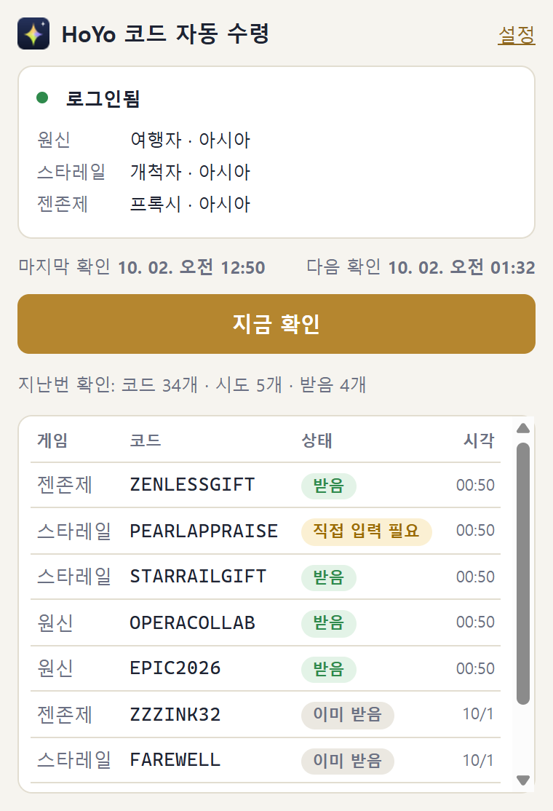
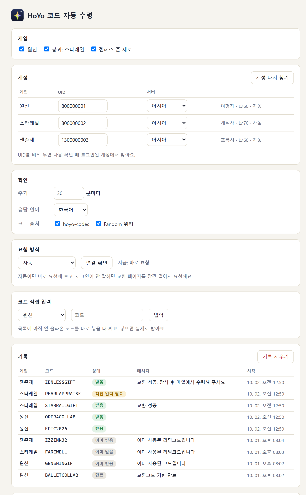
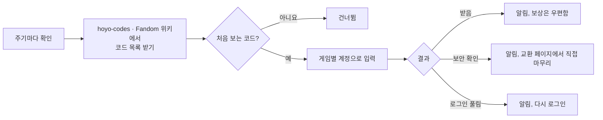

<div align="center">


# HoYo 코드 자동 수령

원신 · 붕괴: 스타레일 · 젠레스 존 제로<br>
새 리딤코드가 나오면 로그인된 HoYoverse 계정으로 대신 입력해 주는 크롬 확장

[](https://github.com/chhwang93/hoyo-redeem-extension/releases/latest)
[](LICENSE)

<br>


**[최신 버전 받기](https://github.com/chhwang93/hoyo-redeem-extension/releases/latest)** · [설치 방법](#설치) · [자세한 설명](hoyo-auto-redeem/README.md)

</div>

> [!WARNING]
> HoYoverse와 관계없는 비공식 도구입니다. 공개되지 않은 HoYoverse API를 쓰기 때문에 언제든 동작하지 않을 수 있고, 계정에 생기는 문제는 쓰는 사람 책임입니다. 쓰기 전에 HoYoverse 이용약관을 확인해 주세요.

## 하는 일

방송이나 이벤트로 풀리는 리딤코드는 며칠 만에 끝나는 경우가 많습니다. 이 확장은 코드 목록을 주기적으로 확인하다가 새 코드가 보이면 바로 입력해 둡니다. 보상은 평소처럼 게임 우편함으로 옵니다.

- **알아서 찾기**: [hoyo-codes](https://hoyo-codes.seria.moe)와 Fandom 위키를 30분마다 확인합니다. 주기는 설정에서 바꿀 수 있습니다.
- **한 번만 입력**: 이미 받았거나 끝난 코드는 기억해 두고 다시 보내지 않습니다.
- **게임별 계정**: 로그인된 HoYoverse 계정에서 게임마다 캐릭터를 찾아 UID와 서버를 채웁니다.
- **필요할 때만 알림**: 코드를 받았을 때, 직접 입력이 필요할 때, 로그인이 풀렸을 때만 알려 줍니다.

## 지원 게임

| 게임 | 코드 출처 | 보안 확인 |
| --- | --- | --- |
| 원신 | hoyo-codes, Fandom 위키 | 없음 |
| 붕괴: 스타레일 | hoyo-codes, Fandom 위키 | 가끔 뜰 수 있음 |
| 젠레스 존 제로 | hoyo-codes, Fandom 위키 | 가끔 뜰 수 있음 |

게임은 설정에서 따로 켜고 끌 수 있습니다. 한 번 로그인하면 세 게임 모두 됩니다.

## 화면

<table>
  <tr>
    <th>팝업</th>
    <th>설정</th>
  </tr>
  <tr>
    <td valign="top">
      <picture>
        <source media="(prefers-color-scheme: dark)" srcset="docs/images/popup-dark.png">
        
      </picture>
    </td>
    <td valign="top">
      <picture>
        <source media="(prefers-color-scheme: dark)" srcset="docs/images/options-dark.png">
        
      </picture>
    </td>
  </tr>
</table>

화면의 닉네임과 UID는 예시입니다.

## 동작 방식



요청 사이는 5.5초 이상 띄우고, 로그인이 풀렸거나 요청이 막히면 그 자리에서 멈췄다가 다음 확인 때 다시 합니다. 요청 형식과 응답 처리는 [자세한 설명](hoyo-auto-redeem/README.md)에 있습니다.

## 설치

1. [최신 버전](https://github.com/chhwang93/hoyo-redeem-extension/releases/latest)에서 `hoyo-redeem-extension-버전.zip`을 받아 압축을 풉니다.
2. 크롬 주소창에 `chrome://extensions`를 입력하고, 오른쪽 위 **개발자 모드**를 켭니다.
3. **압축해제된 확장 프로그램 로드**를 누르고 풀린 `hoyo-auto-redeem` 폴더를 고릅니다.
4. [원신 교환 페이지](https://genshin.hoyoverse.com/ko/gift)에서 HoYoverse 계정으로 로그인합니다.
5. 툴바의 아이콘을 눌러 **지금 확인**을 누릅니다. 처음에는 지금 올라와 있는 코드를 모두 시도해서 몇 분 걸립니다.

압축을 푼 폴더는 지우거나 옮기지 마세요. 크롬이 그 폴더를 계속 읽고, 옮기면 다른 확장으로 인식해서 기록이 사라집니다.

### 업데이트

새 버전 zip을 받아 **같은 폴더에 덮어쓴** 뒤 `chrome://extensions`에서 이 확장의 새로고침(↻)을 누릅니다. 기록과 설정은 그대로 남습니다.

> [!NOTE]
> 1.1.0까지는 폴더 이름이 `genshin-auto-redeem`이었습니다. 새 zip의 `hoyo-auto-redeem` 폴더를 따로 로드하지 말고, 그 안의 파일을 쓰던 `genshin-auto-redeem` 폴더에 덮어쓰세요. 폴더 이름은 그대로 둬도 됩니다. 새 폴더를 로드하면 다른 확장으로 인식해서 기록과 설정이 처음부터 시작합니다.

## 자주 묻는 질문

<details>
<summary>로그인 정보가 밖으로 나가나요?</summary>

아니요. 확장은 쿠키를 저장하거나 복사하지 않고, 브라우저가 요청에 붙이는 쿠키를 그대로 씁니다. 요청은 HoYoverse 주소로만 가고, 코드 목록은 hoyo-codes와 Fandom 위키에서 받기만 합니다. UID와 기록은 크롬 안(`chrome.storage.local`)에만 저장됩니다.
</details>

<details>
<summary>"직접 입력해 주세요" 알림이 왔어요</summary>

스타레일과 젠존제는 교환할 때 가끔 보안 확인(퍼즐)을 요구합니다. 이 확장은 보안 확인을 풀지 않습니다. 알림을 누르면 코드가 들어간 공식 교환 페이지가 열리니 퍼즐만 풀어 주세요. 그 게임은 6시간 동안 자동 입력을 쉽니다.
</details>

<details>
<summary>"로그인 필요" 알림이 왔어요</summary>

HoYoverse 로그인이 풀린 상태입니다. 알림을 눌러 교환 페이지에서 다시 로그인한 뒤 팝업의 지금 확인을 누르면 바로 이어서 합니다.
</details>

<details>
<summary>크롬을 꺼 두면요?</summary>

크롬이 켜져 있을 때만 확인합니다. 꺼져 있던 동안의 주기는 건너뛰고, 다음에 켤 때 한 번 확인합니다. 방송 코드처럼 짧게 끝나는 코드는 그 사이에 놓칠 수 있습니다.
</details>

<details>
<summary>한 게임에 캐릭터가 여러 개예요</summary>

자동으로 찾을 때는 서버마다 공식 교환 페이지처럼 첫 번째 캐릭터를 씁니다. 다른 캐릭터로 받으려면 설정의 계정 칸에 UID를 직접 입력하세요.
</details>

## 개발

Node 22만 있으면 따로 설치할 패키지 없이 돌아갑니다.

```bash
npm test
```

```bash
npm run check:sources
```

```bash
npm run icons
```

차례로 단위 테스트, 실제 코드 출처가 아직 파싱되는지 확인, 아이콘 다시 만들기입니다. 코드 구조는 [자세한 설명의 파일 목록](hoyo-auto-redeem/README.md#파일)을 보세요.

## 라이선스

[MIT](LICENSE). 단, `tests/fixtures/`의 위키 문서 내용은 Fandom의 CC BY-SA 라이선스를 따릅니다([출처](tests/fixtures/README.md)).

게임 이름과 상표는 HoYoverse의 것입니다. 아이콘은 이 저장소에서 따로 그린 것으로 공식 이미지를 쓰지 않았습니다.
